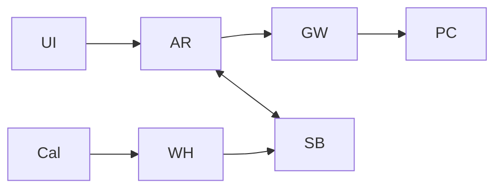

# Jarvis Windows fase inicial
## Resumen ejecutivo
App en segundo plano (tray) para chat/proyectos/carpetas + tablero y “toggle tracking” con consentimiento. Ejecuta acciones vía OpenClaw (local/VPS) y sincroniza a Supabase; Calendar integrado; WhatsApp solo opcional por riesgos.

## Arquitectura
Desktop (Electron o Tauri), Agent Runtime local, OpenClaw Gateway (loopback+token), Supabase (RLS+Realtime) y webhook VPS. Calendar: OAuth apps instaladas + push (watch/webhook). citeturn1search1turn1search0turn8search2turn9search1turn3search6turn0search3turn0search0turn2search5turn2search0turn8search0

## Agente IA
Gemini: function calling con declaraciones tipo OpenAPI subset + allowlist; Claude: strict tool use/structured outputs; HITL/“ask always” en acciones destructivas. citeturn4search0turn3search2

## WhatsApp y legal
WhatsApp Business Solution Terms (15 Ene 2026) prohíben “AI Providers” si la IA es la funcionalidad primaria; también restringen uso de datos para entrenar modelos. Alternativa: WhatsApp Web (Baileys) vía OpenClaw, pero no-oficial → riesgo de baneos. citeturn7view0turn6search1

## Documento completo
Incluye checklist LFPDPPP (MX). citeturn5search57  
[Descargar informe con tablas, esquema Supabase y diagrama mermaid](sandbox:/mnt/data/Plan_Jarvis_Windows_Fase1.md)