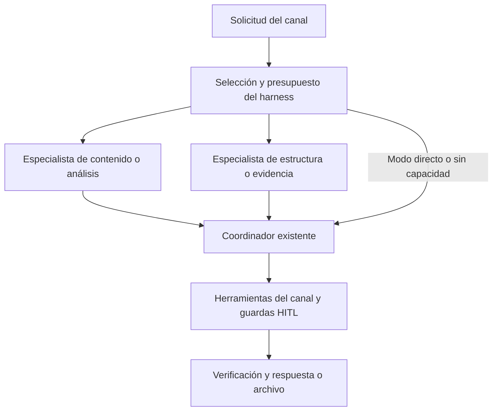

# Arnés multiagente de SofLIA

Estado: vigente. Actualizado: 2026-09-23.

<!-- evidence: electron/agent-runtime/service.ts -->
<!-- evidence: electron/agent-runtime/runtime.ts -->
<!-- evidence: electron/codex-runtime/provider.ts -->
<!-- evidence: src/components/meetings/MultiAgentPanel.tsx -->
<!-- evidence: src/shared/agent-runtime.ts -->
<!-- evidence: src/shared/agent-teams/runner.ts -->
<!-- evidence: src/shared/agent-teams/policy.ts -->
<!-- evidence: src/services/gemini-chat/agent-team.ts -->
<!-- evidence: electron/wa-agent/agent-team.ts -->
<!-- evidence: electron/desktop-agent/gemini-cu/client.ts -->
<!-- evidence: electron/presentation-workflow/html-generator.ts -->

## Equipos en chat, WhatsApp, navegador y entregables

Las solicitudes de documentos, presentaciones y análisis complejos activan dos
especialistas en paralelo. Sus aportes se entregan al coordinador existente,
que conserva las herramientas y realiza las acciones con las guardas de la
superficie. Un saludo o un clic aislado no añade especialistas.

El arnés decide el equipo y gobierna su ejecución; los especialistas aportan
trabajo; el coordinador integra esos aportes. Las guardas de herramientas de
cada canal siguen siendo la autoridad sobre efectos reales. El arnés no les
otorga permisos adicionales a los modelos.

| Solicitud | Especialistas | Quién termina el trabajo |
|---|---|---|
| Crear Word, PDF o informe desde chat o WhatsApp | Contenido y estructura | El agente del canal usa sus herramientas de archivos |
| Crear presentación desde chat o flujo WhatsApp | Contenido y diseño | La Skill/generador existente valida y materializa deck.json |
| Revisar una página desde chat/navegador | Análisis de página y evidencia | El chat integra el DOM o extractos ya autorizados |
| Computer Use con varios pasos | Plan y verificación | Un solo controlador conserva capturas, acciones y aprobaciones |
| Análisis complejo general | Análisis y evidencia | El modelo conversacional seleccionado |

El chat completo, orbe y chat del navegador comparten el pipeline. Los equipos
usan el mismo proveedor/modelo resuelto para ese turno: Gemini u OpenAI en chat,
Gemini en WhatsApp y Computer Use. El adaptador Codex sigue siendo exclusivo
del panel de reuniones. No se transfieren las sesiones personales de Codex.

Ejemplos que se pueden escribir directamente:

- `Revisa esta página y señala problemas de claridad y datos sin respaldo.`
- `Crea un informe ejecutivo con estos resultados: ...`
- `Crea una presentación de seis diapositivas con esta información: ...`
- `modo equipo: compara estas dos propuestas y señala sus supuestos: ...`
- `modo directo: redacta un informe breve con estos datos: ...`

Los prefijos `modo equipo:` y `modo directo:` se reconocen al inicio del pedido.
En el flujo dedicado de presentaciones de WhatsApp se pueden indicar al aportar
los datos o al aprobar: `modo directo: si`. La selección permanece para esa
presentación. Son controles por solicitud, no una preferencia persistente de
cuenta. Un Computer Use delegado tiene su propia fase y selección; el prefijo
del chat no se propaga como un permiso o ajuste global a otras herramientas.

Los especialistas de página sólo reciben el texto del turno, DOM, documento
activo o extractos que el chat ya obtuvo bajo sus reglas. En modo de extractos
no adquieren búsqueda, navegación ni acceso a otras pestañas. Los especialistas
de Computer Use reciben contexto semántico cuando existe; la captura visual
permanece en el controlador. No afirman haber inspeccionado imágenes no recibidas.

Los especialistas no disponen de herramientas, memoria compartida ni historial
de otros chats. Preparan aportes; no abren páginas por su cuenta, no escriben
archivos en paralelo y no ejecutan acciones. El coordinador debe obtener las
fuentes faltantes y verificar el resultado real. Un borrador de especialista
no demuestra que un documento exista ni autoriza enviar, pagar o borrar.

El chat muestra `Especialistas trabajando en equipo...` mediante el canal de
actividad existente; los eventos incluyen tipo, estado, duración y número de
aportes completos, sin contenido. Main registra los mismos metadatos. No hay
un panel persistente ni reanudación de estos equipos: los aportes son efímeros.

### Límites y rendimiento de equipos generales

La fuente es [TEAM_LIMITS](../../src/shared/agent-teams/policy.ts): dos workers
por equipo, cuatro peticiones de especialistas pendientes por proceso, quince segundos por
equipo, 4000 caracteres de solicitud, 24000 de fuente, 1500 tokens solicitados
y 6000 caracteres conservados por aporte. El límite de concurrencia no es
global entre main y renderer. Los datos truncados se etiquetan para el worker;
el coordinador conserva el contexto original de su ruta.

Si no hay cupo se continúa con un coordinador, sin cola. Si falla un especialista,
se aprovecha el otro; si fallan ambos, se mantiene el flujo normal. Cancelar
descarta resultados tardíos. Si un proveedor ignora abort, su cupo permanece
ocupado hasta que termine realmente; no se lanza otra petición para sustituirlo.

Los workers añaden hasta dos llamadas por fase. El consumo Max se reserva una
vez antes de su primera llamada y sus tokens reportados se contabilizan. No
se promete ahorro monetario. Una tarea de chat que después delega a Computer Use
puede preparar otro equipo en esa segunda fase. El paralelismo de los workers
está probado; una mejora real de rapidez o calidad frente al flujo directo
requiere evaluación con los modelos y documentos del usuario.

Las presentaciones dedicadas conservan su aprobación y exportación existentes.
Cancelar detiene etapas posteriores y evita iniciar el envío; una operación
local o envío ya iniciado no se revierte automáticamente.

## Uso en Meeting Ops

En Meeting Ops, escribe título y transcripción en el formulario y usa **Análisis en equipo**.
El especialista de acuerdos y el de evidencia trabajan en paralelo; después,
el coordinador prepara una minuta. El panel muestra aportes, estados, tokens
observados y consultas. La fuente se entrega como datos a cada etapa mediante
el mismo dispatcher autorizado que atiende herramientas adicionales.

Gemini utiliza la clave existente de SofLIA y su modelo runtime. Para Codex,
abre Configurar Codex, selecciona su ejecutable nativo y guarda una clave API
OpenAI del contexto actual. La clave nunca se devuelve al renderer. La
configuración se conserva cifrada cuando el sistema permite hacerlo.
No se reutiliza la sesión personal de la aplicación Codex ni se copia auth.json.
La selección del ejecutable y el handshake se validan; la ejecución de modelos
requiere una cuenta y un modelo accesibles.

Revisa la minuta y marca la confirmación antes de **Crear borrador revisable**.
La autorización dura diez minutos y se liga al digest del resultado. El
pipeline existente procesa ese borrador y conserva sus revisiones/aprobaciones
antes de sincronizar acciones. Esta operación no equivale a enviar correos o
crear tareas aprobadas. Actualiza la lista de Meeting Ops para consultar el
borrador y su revisión.

## Arquitectura y alcance

[Orquestador](../../electron/agent-runtime/service.ts) → proveedor
[Gemini](../../electron/agent-runtime/gemini-provider.ts) o
[Codex](../../electron/codex-runtime/provider.ts) → catálogo cerrado de
[herramientas](../../electron/agent-runtime/tools.ts).

El equipo tiene un grafo fijo, sin delegación recursiva: acuerdos y evidencia,
seguidos de coordinador. El host controla la concurrencia. Esta implementación
usa threads independientes del app-server; no habilita las herramientas nativas
de spawn de Codex. Los roles son una estrategia de meeting-agent, no identidades
con permisos adicionales dentro de MCPManager.

Las herramientas permitidas son leer_transcripcion, buscar_evidencia y,
solo para el coordinador, leer_aportes. Ninguna realiza efectos externos. No
se cargan skills de desarrollo, Git, shell, plugins personales ni herramientas
arbitrarias del MCPManager. El dispatcher comparte validación y presupuesto
entre proveedores. No hay servidor MCP de SofLIA abierto en red.

Codex usa JSON por líneas a través de stdio, hogar por usuario/organización,
variables mínimas y credencial efímera dentro del proceso. Antes de enviar el
turno, se exige environments vacío, ausencia de instrucciones externas y un
inventario MCP vacío. Las herramientas dinámicas y selectedCapabilityRoots
requieren soporte experimental: una incompatibilidad termina la conexión.
Cada especialista usa su propio proceso; al cancelar se cierra ese proceso
aislado. No se conserva un turno de Codex para reanudarlo después.

La integración consume el binario instalado; no redistribuye código ni binarios
de Codex. La licencia raíz del repositorio investigado es Apache-2.0. Una futura
distribución debe revisar también NOTICE y licencias de componentes incluidos;
esta entrega no empaqueta bubblewrap ni otro componente de terceros.

## Identidad, permisos y efectos

La sesión SOFIA validada por main fija el propietario del arnés. Una organización
seleccionada requiere membresía activa en organization_users. El renderer no
puede suministrar userId, catálogo, RPC, rutas de trabajo ni políticas arbitrarias.

La creación del borrador utiliza el identificador de la sesión Lia, que puede
diferir del de SOFIA. Se comprueban ambas identidades entre etapas del pipeline.
Si cambia la sesión se detienen operaciones posteriores. Un efecto ya iniciado
puede haberse completado: se conserva estado incierto en vez de reintentarlo.

Los handlers verifican ventana principal, frame principal, payload y contexto.
Cambiar contexto, cerrar sesión o salir del panel cancela el análisis y retira
confirmaciones. La minuta no concede autoridad por contener instrucciones.

## Persistencia y recuperación

El [repositorio](../../electron/agent-runtime/repository.ts) guarda snapshots
cifrados con safeStorage, por hash de usuario/organización, bajo
userData/agent-runtime/runs. Valida el esquema al leer, escribe mediante reemplazo
atómico y conserva veinte ejecuciones por ámbito. Sin cifrado seguro, trabaja
en memoria y lo indica en el panel; no degrada a texto claro.

Al abrir un ámbito, ejecuciones que estaban activas o pendientes de revisión se
muestran interrumpidas, con sus aprobaciones retiradas. Recuperar crea una nueva
ejecución de lectura ligada a la anterior. Una publicación pendiente al reiniciar
se vuelve incierta y no se repite automáticamente.

Si aparece **Comprueba el resultado en Meeting Ops**, revisa la lista antes de
crear otra operación. No se promete entrega exactamente una vez entre sistemas;
el servicio Meeting Ops conserva además su deduplicación por fuente, propietario
y comprobación de organización antes de reutilizar una ejecución.

La retención local del arnés no elimina los borradores ya guardados en Meeting
Ops ni gestiona la retención del proveedor. No hay sincronización del historial
del arnés entre dispositivos.

## Límites y verificación

La fuente de parámetros es [AGENT_LIMITS](../../src/shared/agent-runtime.ts):
80000 caracteres de fuente, 24000 por salida, doce consultas por etapa, seis
llamadas por etapa Gemini, 3000 tokens de salida solicitados por llamada Gemini,
tres minutos por análisis y treinta segundos por solicitud RPC.
Codex se corta por duración, herramientas y uso observado; no se garantiza un
tope monetario ni un número exacto de iteraciones internas del motor.

Las citas de líneas facilitan revisión humana; no prueban por sí solas que la
interpretación del modelo sea correcta. La integración no acredita una mejora
de calidad o costo frente a un agente único sin evaluación con datos reales.

Ver [evidencia del cambio](../../openspec/changes/integrate-multiagent-harness/reports/verification.md).
El test codex-runtime-native es opt-in mediante SOFLIA_CODEX_TEST_EXECUTABLE y
comprueba el handshake sin inferencia. Las pruebas de proveedores usan procesos
simulados para comprobar fallos, herramientas prohibidas y cancelación.

## Monitor de equipos

Cuando comienza un equipo, el Hub abre una ventana nativa «Equipo de SofLIA»
sin solicitar el foco. El botón «Ver equipos de agentes» de la parte superior
permite recuperarla. Se puede minimizar, ocultar y plegar cada equipo; ninguna
de estas acciones cancela la tarea. Al terminar conserva los últimos doce
equipos en memoria; cerrar sesión o cambiar de usuario borra este estado.

La ventana muestra canal, categoría, roles, estado individual, tiempo observado
y número de aportes completados. «Aportes listos» indica que terminaron los
especialistas; el coordinador todavía puede estar redactando o ejecutando la
tarea principal. No presenta porcentajes estimados, prompts, fuentes, mensajes,
salidas del modelo ni credenciales.

Los eventos de [runner](../../src/shared/agent-teams/runner.ts) cubren Chat del
Hub, WhatsApp, preparación del navegador, Computer Use, documentos y
presentaciones cuando esas rutas activan equipos. Meeting Ops proyecta sus
etapas desde el arnés existente. El publicador renderer se limita a la ventana
principal y a su frame principal autenticado; el chat de la Orbe no publica
actividad en este monitor. El modo directo no abre un equipo.

[Main](../../electron/agent-activity/index.ts) valida esquemas cerrados,
identidad y secuencias; ignora eventos atrasados y cierra los equipos de reuniones
que desaparecen al cambiar de contexto. Los errores de observación no deben
interrumpir el trabajo. La ventana auxiliar carga exclusivamente la vista del
monitor y recibe un preload limitado al puente `agentActivity`. No puede
ejecutar herramientas. Además de pruebas unitarias, el smoke nativo se ejecuta
con `node scripts/quality/smoke-agent-activity.mjs` después de `npm run build:app`.
Carga el renderer y preload compilados con datos sintéticos, sin bootstrap ni
proveedores. Comprueba ocultar/reabrir/minimizar/cerrar y genera una captura en
un directorio temporal aislado. No valida inferencias ni el foco frente a otras
aplicaciones; esas comprobaciones permanecen separadas.

## Retirada

Retirar el panel y initializeAgentRuntime desactiva esta capacidad. No requiere
migraciones. Los borradores creados permanecen en Meeting Ops y siguen sus
políticas de retención. Las rutas de datos locales y las credenciales guardadas
se gestionan aparte; no se borran implícitamente al quitar la interfaz.
